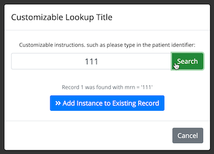

## Public Repeat Data Collection (PRDC)

#### What It Does
This module allows an unauthenticated user, via the public survey URL, to add repeated observations to a record via a known record id (e.g. MRN)

It supports two modes:

1. **REPEAT INSTANCE REDIRECT:** A single survey can be made repeating and each repeat entry will create a new instance of that survey
1. **SURVEY QUEUE REDIRECT:** Alternately, if a participant already exists, you can redirect to their survey_queue url for additional entry (depending on how your queue was configured)

#### How to configure it
This was built around a design as:
1. First survey is public and you use the public survey queue to access the project.
1. You have an event with a repeating form (repeating events from the public survey are not currently supported)

So, a typical project might look like:

* Survey 1:
  * Intake Form (contains a field called mrn) and some basic intake questions, like demographics.
  * You enable 'auto-continue' to next survey so after they complete this for a new record it moves on to Survey 2.
* Survey 2:
  * Contains repeating form, like Adverse Event.  This survey is marked as 'repeating'.  It does not have to be in the baseline event if the project is longitudinal.

 When the public survey is opened, the user will not see the public survey.  Instead they see a modal dialog to enter the 'lookup' field, in this case MRN.
 They enter a value and search via ajax.  If no match is found, they continue data entry on Survey 1.  If a match is found, they can instead continue data entry with the next instance of Survey 2 for the existing record.

#### What Problem Does It Address
The use case was one where many hospital staff, some without REDCap authentication, were asked to register all instances of certain event into a database via the public survey url.

If a patient was new, additional one-time questions might be asked.  If the patient already existed in the database, these one-time questions were repetitive and unnecessary.  Furthermore, since the project owners wanted one-record-per-participant they would have to 'merge' these repeat records into a single record after-the-fact.

With this module, during the data entry process the unauthenticated user is redirected to the appropriate survey for data entry

#### Are There Security Concerns
Like any survey tool, one must be careful about how it is used so as to not inadvertently expose previously entered data, especially PHI.

In **REPEAT INSTANCE REDIRECT**, there are at least two potential security issues to be aware of:
1. If someone has the public URL and knows an identifier, the could determine if that identifier had a record in the database.  They would not be able to see any information about the record other than implying its existence.
1. If a design user pipes data from the record into the repeating survey, that data could be exposed by the person completing a repeat entry.  So, piping of any identifiers into the repeating survey is discouraged.

In **SURVEY QUEUE REDIRECT** there are at least three potential security issues to be aware of:
1. If the record has existing forms that were enabled as surveys but completed as data entry forms, they can be opened in the Survey Queue so the manually entered data could be read.  For this reason, it is not recommended to enable any form as a survey if you are going to enter data manually.
1. If you enable save and return later without a passcode, previously entered data could be viewed from the survey queue.
1. The same piping disclaimer from above also applies here.

